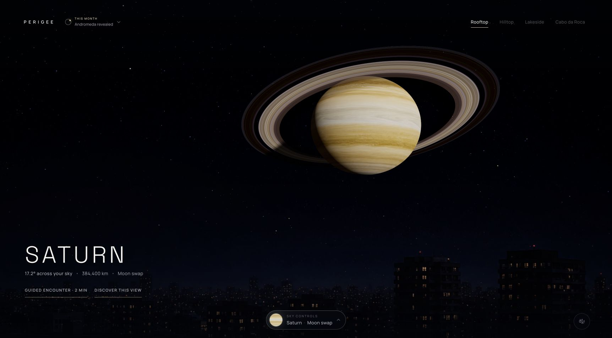

# Perigee

**Impossible skies, rendered at honest scale.**

Perigee is an interactive, cinematic sky experience that lets you bring planets,
stars, and the Andromeda Galaxy impossibly close. Apparent sizes come from real
geometry, while concise discoveries explain what is calculated, what is rendered,
and what is described rather than simulated.

[Explore Perigee live](https://perigee.observer)



## Highlights

- Explore nine celestial objects across five object-specific distance states.
- Move between Rooftop, Hilltop, Lakeside, and Cabo da Roca viewpoints.
- Follow short guided encounters with optional prediction-and-reveal moments.
- Open sourced, state-aware discoveries without leaving the live scene.
- Capture a clean view, download it, or share a link that restores the same sky.
- Enable an optional procedural ambient soundscape for each viewpoint.
- Use the complete experience with a keyboard or reduced motion enabled.

Perigee is deliberately not a planetarium catalogue or physical-effects
simulator. It calculates apparent angular size exactly; environmental lighting,
surface treatments, and impossible proximity effects are authored visualizations.

## Technology

- Nuxt 3 and Vue 3 for the application shell and accessible controls
- Three.js and custom shaders for the sky, celestial objects, and environments
- GSAP for interruptible scene choreography
- Native Web Audio for the first-party procedural ambience
- Vitest and strict TypeScript for scientific and product contracts
- Static generation for deployment to Cloudflare Workers Static Assets

## Run locally

Requirements:

- Node.js 24 or newer
- A browser with WebGL2

```bash
git clone git@github.com:aliaks-ei/perigee.git
cd perigee
npm ci
cp .env.example .env
npm run dev
```

Open the local URL printed by Nuxt. No environment variable is required for
ordinary local development. Analytics remains disabled unless an Umami website
ID is explicitly configured.

## Commands

| Command | Purpose |
| --- | --- |
| `npm run dev` | Start the Nuxt development server |
| `npm run typecheck` | Run strict Nuxt and Vue TypeScript checks |
| `npm test` | Run the Vitest suite once |
| `npm run test:watch` | Run Vitest in watch mode |
| `npm run build` | Build the production application |
| `npm run generate` | Generate the static site |
| `npm run verify` | Run type checking, tests, and the production build |

Run `npm run verify` before opening a pull request.

## Project structure

```text
app/                    Nuxt components, composables, content, and UI helpers
src/perigee/            Framework-independent Three.js and Web Audio engines
assets/css/             Ordered global styles, tokens, and transitions
public/assets/          Runtime imagery, social cards, icons, and attribution
tests/                  Deterministic Vitest coverage for product contracts
docs/                   Active editorial, analytics, and curation procedures
```

The Vue layer owns product state and controls. The engine under `src/perigee/`
owns rendering and audio and does not depend on Vue. They meet through narrow
typed interfaces in `app/types/`.

## Content, privacy, and assets

- Scientific and editorial records live in `app/data/editorial.ts`; the review
  process is documented in [`docs/editorial-content.md`](docs/editorial-content.md).
- Analytics uses a provider-neutral event contract and excludes free-form text,
  precise location, and persistent visitor identifiers. See
  [`docs/engagement-events.md`](docs/engagement-events.md).
- Monthly features reuse approved encounters. The operating checklist is in
  [`docs/featured-encounters.md`](docs/featured-encounters.md).
- Runtime asset sources, modifications, and licences are recorded in
  [`public/assets/ATTRIBUTIONS.md`](public/assets/ATTRIBUTIONS.md).

## Contributing

Keep changes focused, preserve the minimal resting interface, and add regression
tests when changing scientific calculations, editorial contracts, presets, or
scene direction. Visual changes should include desktop and mobile evidence and
must retain keyboard, focus, reduced-motion, and capability-fallback behavior.

New runtime assets require complete provenance in
`public/assets/ATTRIBUTIONS.md` before they ship.

## License

The source code is available under the [MIT License](LICENSE). Runtime assets
retain the licences recorded in
[`public/assets/ATTRIBUTIONS.md`](public/assets/ATTRIBUTIONS.md) and are not
relicensed by the MIT grant.
